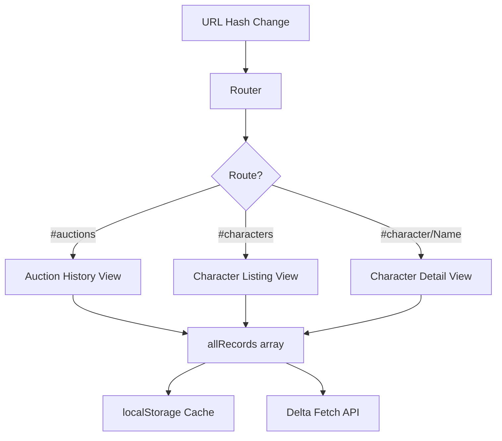
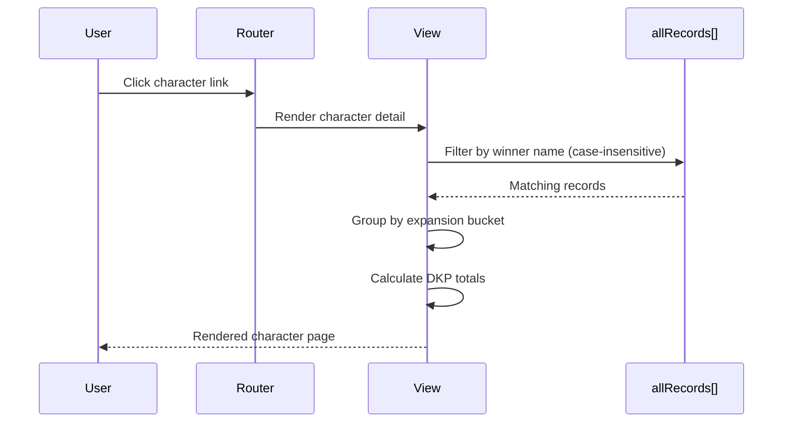

# Design Document: Character Detail Page

## Overview

The Character Detail Page feature extends the existing DKP Bid Tracker web viewer with per-character navigation and DKP spending breakdowns. The implementation adds a navigation bar, makes winner names clickable, introduces a character listing page, and provides a character detail page that groups DKP spending by EverQuest expansion date ranges.

The web viewer is a static single-page application (HTML/CSS/JS) hosted on S3 that fetches auction data from an API and caches it in localStorage. This feature builds on the existing architecture by adding client-side routing (hash-based) and new view-rendering functions that consume the same `allRecords` in-memory data source already used by the auction table.

### Key Design Decisions

1. **Hash-based client-side routing** — Uses `window.location.hash` to switch between views (e.g., `#auctions`, `#characters`, `#character/PlayerName`). No server-side changes or additional HTML files needed.
2. **Single shared data source** — All views derive data from the existing `allRecords` array, which already handles caching and delta-fetch updates.
3. **No build tooling** — The project uses vanilla JS with no bundler. This feature follows the same pattern to maintain consistency.
4. **Expansion buckets as a static configuration** — Date ranges are defined as a constant array and can be extended easily when new expansions launch.

## Architecture

The feature uses a simple client-side SPA routing pattern layered on top of the existing IIFE module in `app.js`.



### Routing

| Hash Pattern | View | Description |
|---|---|---|
| `#auctions` (or empty) | Auction History | Current main table view |
| `#characters` | Character Listing | Alphabetical list of all winners |
| `#character/{name}` | Character Detail | Per-character DKP breakdown |

### Data Flow



## Components and Interfaces

### 1. Router Module

Handles hash-based navigation and view switching.

```javascript
/**
 * Initialize the router. Listens for hashchange events.
 * On route change, hides all views and renders the appropriate one.
 */
function initRouter() { ... }

/**
 * Navigate to a given hash route.
 * @param {string} route - e.g., '#character/Playername'
 */
function navigateTo(route) { ... }

/**
 * Parse the current hash into a route object.
 * @returns {{ view: string, param?: string }}
 */
function parseRoute() { ... }
```

### 2. Navigation Bar Component

Renders and manages the top navigation links.

```javascript
/**
 * Render the navigation bar with active-state highlighting.
 * @param {string} activeView - Currently active view identifier
 */
function renderNavBar(activeView) { ... }
```

### 3. Expansion Bucket Classifier

Pure function module for classifying records into expansion date ranges.

```javascript
/**
 * Expansion bucket definitions (ordered newest-first for display).
 * @type {Array<{ name: string, startDate: string, endDate: string|null }>}
 */
const EXPANSION_BUCKETS = [
  { name: 'Planes of Power', startDate: '2026-10-01', endDate: null },
  { name: 'Shadows of Luclin', startDate: '2026-01-01', endDate: '2026-09-30' },
  { name: 'Scars of Velious', startDate: '2025-04-01', endDate: '2025-12-31' },
  { name: 'Ruins of Kunark', startDate: '2024-07-01', endDate: '2025-03-31' },
  { name: 'Classic', startDate: '2023-12-01', endDate: '2024-06-30' },
];

/**
 * Classify a single auction record into an expansion bucket.
 * Records before Classic's start date are assigned to "Classic".
 * Records not matching any defined range fall into "Other".
 * @param {AuctionRecord} record
 * @returns {string} Expansion bucket name
 */
function classifyRecord(record) { ... }

/**
 * Group an array of records by expansion bucket.
 * @param {AuctionRecord[]} records
 * @returns {Map<string, AuctionRecord[]>} Bucket name → records
 */
function groupByExpansion(records) { ... }
```

### 4. Character Detail View

Renders the per-character DKP breakdown page.

```javascript
/**
 * Render the character detail page into the main content area.
 * @param {string} characterName - The character to display
 * @param {AuctionRecord[]} allRecords - Full record set
 */
function renderCharacterDetail(characterName, allRecords) { ... }

/**
 * Render the DKP summary table (expansion → total DKP, item count).
 * @param {Map<string, AuctionRecord[]>} groupedRecords
 * @returns {string} HTML string
 */
function renderDkpSummary(groupedRecords) { ... }

/**
 * Render the item breakout section for a single expansion bucket.
 * Items sorted by date newest-first.
 * @param {string} bucketName
 * @param {AuctionRecord[]} records
 * @returns {string} HTML string
 */
function renderItemBreakout(bucketName, records) { ... }
```

### 5. Character Listing View

Renders the alphabetical list of all characters.

```javascript
/**
 * Render the character listing page.
 * @param {AuctionRecord[]} allRecords - Full record set
 */
function renderCharacterListing(allRecords) { ... }

/**
 * Compute unique characters with their total DKP spent.
 * @param {AuctionRecord[]} records
 * @returns {Array<{ name: string, totalDkp: number }>} Sorted alphabetically
 */
function getCharacterSummaries(records) { ... }
```

### 6. Updated Auction Table Rendering

The existing `renderTable()` function is modified to render winner names as clickable links.

```javascript
/**
 * Render a winner name cell as a clickable link.
 * @param {string} winnerName
 * @returns {string} HTML anchor element string
 */
function renderWinnerLink(winnerName) { ... }
```

## Data Models

### AuctionRecord (existing)

```typescript
interface AuctionRecord {
  item_name: string;
  winner: string;
  amount: number;
  timestamp: string;       // ISO 8601
  bid_count?: number;
  dedup_key: string;
  uploaded_by?: string;
  confirmed_by?: string[];
  bids?: Bid[];
}
```

### ExpansionBucket (new)

```typescript
interface ExpansionBucket {
  name: string;            // e.g., "Ruins of Kunark"
  startDate: string;       // ISO date "YYYY-MM-DD"
  endDate: string | null;  // null means open-ended (ongoing)
}
```

### CharacterSummary (new, derived)

```typescript
interface CharacterSummary {
  name: string;
  totalDkp: number;
}
```

### GroupedCharacterData (new, derived)

```typescript
interface GroupedCharacterData {
  bucketName: string;
  records: AuctionRecord[];
  totalDkp: number;
  itemCount: number;
}
```


## Correctness Properties

*A property is a characteristic or behavior that should hold true across all valid executions of a system — essentially, a formal statement about what the system should do. Properties serve as the bridge between human-readable specifications and machine-verifiable correctness guarantees.*

### Property 1: Record classification assigns exactly one correct bucket

*For any* auction record with a valid ISO 8601 timestamp that falls within a defined expansion date range, `classifyRecord` SHALL return the name of that expansion bucket, and for any record, it SHALL return exactly one bucket name (never undefined or multiple).

**Validates: Requirements 4.1, 4.2**

### Property 2: Pre-Classic timestamps classify as Classic

*For any* auction record with a timestamp before December 1, 2023, `classifyRecord` SHALL return "Classic".

**Validates: Requirements 4.3**

### Property 3: Invalid or missing timestamps classify as Other

*For any* auction record with a null, undefined, or unparseable timestamp, `classifyRecord` SHALL return "Other".

**Validates: Requirements 3.5, 4.4**

### Property 4: Character filter returns only matching records (case-insensitive)

*For any* character name and any array of auction records, filtering the array for that character SHALL return only records whose `winner` field matches the character name case-insensitively, and SHALL return all such records.

**Validates: Requirements 7.1, 7.2**

### Property 5: Winner name renders as link with correct route

*For any* winner name string, the rendered winner cell SHALL produce an anchor element whose href is `#character/{name}`, enabling navigation to the correct character detail page.

**Validates: Requirements 2.1, 2.2, 8.4**

### Property 6: Bucket DKP totals equal sum of record amounts

*For any* array of auction records grouped into a bucket, the calculated total DKP for that bucket SHALL equal the sum of all `amount` values in the array, and the grand total SHALL equal the sum of all individual bucket totals.

**Validates: Requirements 5.1, 5.2, 5.4**

### Property 7: Item breakout contains all record details

*For any* auction record in a bucket, the item breakout section SHALL contain the record's item_name, amount, and a formatted date derived from its timestamp.

**Validates: Requirements 6.1, 6.2, 6.3**

### Property 8: Item breakout sorted newest-first within each bucket

*For any* array of auction records within a single expansion bucket, the item breakout SHALL render items in descending order by timestamp.

**Validates: Requirements 6.4**

### Property 9: Only non-empty buckets are displayed

*For any* character's set of auction records grouped by expansion, the rendered character detail page SHALL display a section for each bucket containing at least one record and SHALL NOT display sections for buckets with zero records.

**Validates: Requirements 3.2, 3.3, 3.4**

### Property 10: Buckets ordered newest-first

*For any* character detail page displaying multiple expansion buckets, the buckets SHALL appear in chronological order from newest to oldest based on their start dates.

**Validates: Requirements 3.6**

### Property 11: Character listing contains all unique winners with correct totals, sorted alphabetically

*For any* array of auction records, `getCharacterSummaries` SHALL return one entry per unique winner name, each with a `totalDkp` equal to the sum of that winner's record amounts, sorted alphabetically by name.

**Validates: Requirements 8.1, 8.2, 8.3**

### Property 12: Character listing search filters by name substring

*For any* search string and character list, filtering SHALL return only characters whose names contain the search string (case-insensitive).

**Validates: Requirements 8.5**

## Error Handling

| Scenario | Behavior |
|---|---|
| Character name in URL doesn't match any records | Display friendly "No records found for {name}" message with a link back to the character listing |
| `allRecords` is empty (still loading) | Show loading indicator; re-render when data arrives |
| Record has missing/null timestamp | Classify into "Other" bucket; still display in item breakout with "--" as date |
| Record has missing/null amount | Treat as 0 for DKP sum calculations |
| Hash contains special characters | URL-decode character name before filtering; use `decodeURIComponent()` |
| Hash is empty or unrecognized | Default to auction history view (`#auctions`) |

## Testing Strategy

### Property-Based Tests (fast-check)

The feature's core logic consists of pure functions (classification, filtering, grouping, sorting) that are ideal for property-based testing. Use [fast-check](https://github.com/dubzzz/fast-check) as the PBT library.

**Configuration:**
- Minimum 100 iterations per property test
- Each test tagged with: `Feature: character-detail-page, Property {N}: {title}`
- Custom arbitraries for generating auction records with varied timestamps, amounts, and winner names

**Properties to implement:**
- Properties 1–4: Test `classifyRecord` and filter functions as pure input→output
- Properties 5–6: Test link generation and DKP calculation functions
- Properties 7–10: Test rendering/grouping output functions
- Properties 11–12: Test `getCharacterSummaries` and search filter

### Unit Tests (example-based)

- Navigation bar renders with correct links (Requirements 1.1–1.5)
- Active state applied to correct nav link for each route (Requirement 1.4)
- Winner links are keyboard-accessible anchor elements (Requirement 2.4)
- Character detail page displays heading with character name (Requirement 3.1)
- Empty character shows "no records found" message (Requirement 7.3)
- Router correctly parses hash patterns

### Integration Tests

- Delta fetch triggers re-render of character detail view (Requirement 7.4)
- Navigation between views preserves allRecords state (Requirement 7.5)
- Full user flow: auction table → click winner → character detail → back to characters

### Manual/Visual Tests

- Navigation bar styling and active indicator (Requirement 1.4)
- Winner link hover/focus visual states (Requirement 2.3)
- Responsive layout on mobile/tablet breakpoints
- Dark theme consistency across new views
