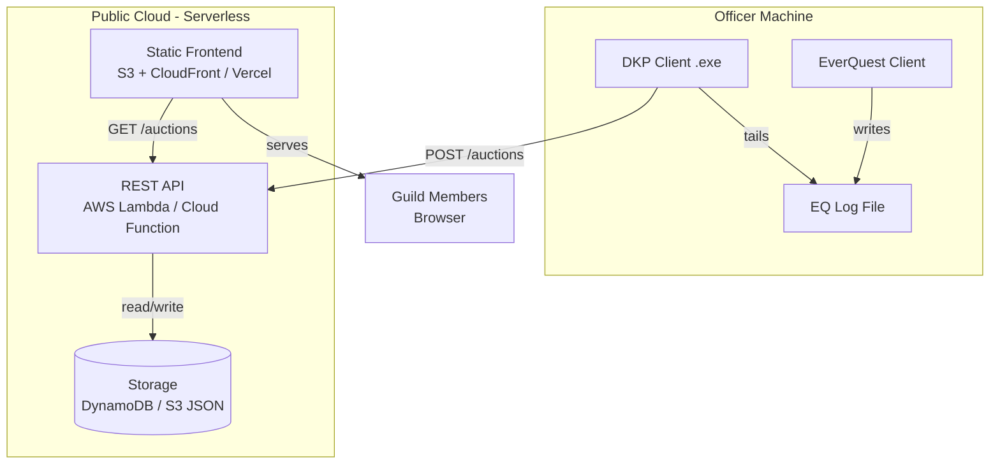
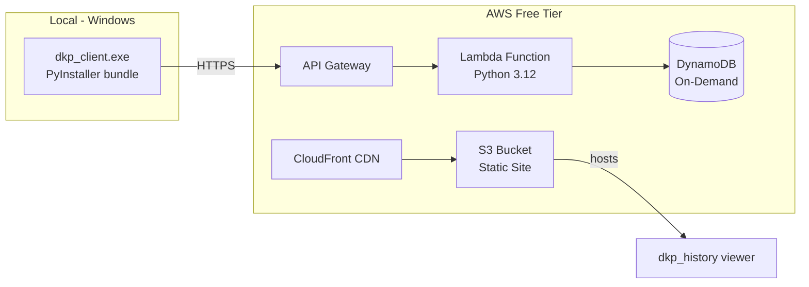

# Design Document: Client-Server DKP Bid Tracker

## Overview

This design moves the DKP bid tracker from a fully local architecture to a client-server model. Officers continue running a local client that monitors EverQuest log files and parses bid auctions, but instead of writing to a local JSON file, the client pushes closed auction records to a lightweight hosted backend. The backend stores history centrally and serves a web-based viewer (evolved from the existing `dkp_history.html`) so anyone in the guild can browse auction history without needing local files.

The guiding constraints are: minimal hosting cost (serverless/free-tier cloud), zero-config "click to start" experience for non-technical officers on Windows, and backward compatibility with the existing auction record format.

## Architecture



### Deployment View



## Components and Interfaces

### Component 1: DKP Client (Local)

**Purpose**: Monitor EQ log files, parse bid auctions in real-time, and push completed auction records to the remote API. Provides a simple "double-click to run" experience on Windows.

**Interface**:
```python
class DKPClient:
    """Local client that wraps the existing tracker logic."""

    def start(self, config_path: str = "dkp_client.ini") -> None:
        """Load config, begin monitoring the active EQ log file."""

    def on_auction_closed(self, record: AuctionRecord) -> None:
        """Called when BidTracker closes an item. Pushes to remote API."""

    def push_record(self, record: AuctionRecord) -> bool:
        """POST a single auction record to the backend. Returns success."""

    def retry_pending(self) -> None:
        """Retry any records that failed to push (offline queue)."""
```

**Responsibilities**:
- Tail the active EQ log file (reuses existing `monitor_log` logic)
- Parse bids and detect auction closures (reuses `BidTracker`, `process_line`)
- Push closed auction records to the remote API over HTTPS
- Queue records locally if the network is unavailable and retry later
- Provide a system-tray icon or simple GUI window for start/stop/status
- Bundle as a single `.exe` via PyInstaller for Windows officers

---

### Component 2: REST API Backend

**Purpose**: Accept auction records from clients, deduplicate, persist to storage, and serve history to the web viewer.

**Interface**:
```python
# POST /auctions
# Request body: AuctionRecord (JSON)
# Response: 201 Created | 200 OK (duplicate) | 401 Unauthorized

# GET /auctions
# Query params: ?since=<ISO timestamp>&session=<raid_session_id>&limit=100&cursor=<token>
# Response: { "records": [...], "next_cursor": "..." }

# GET /auctions/stats
# Response: { "total_auctions": int, "total_dkp_spent": int, "unique_winners": int }
```

**Responsibilities**:
- Validate incoming auction records (schema + API key)
- Deduplicate using the existing `dedup_key` algorithm
- Persist records to DynamoDB (or equivalent)
- Serve paginated history for the web viewer
- Authenticate clients via a shared guild API key (simple bearer token)

---

### Component 3: Static Web Frontend

**Purpose**: Display auction history in a browser. Replaces the need to share `dkp_history.json` files manually.

**Interface**:
- Hosted as static files (HTML/CSS/JS) on S3/CloudFront or Vercel
- Fetches data from `GET /auctions` API endpoint
- No server-side rendering needed

**Responsibilities**:
- Render auction history table with filtering and search (same UX as current `dkp_history.html`)
- Support pagination for large histories
- Auto-refresh or manual refresh to show new auctions
- Responsive design for mobile/desktop

---

### Component 4: Offline Queue (Local)

**Purpose**: Ensure no auction data is lost if the officer's internet drops during a raid.

**Interface**:
```python
class OfflineQueue:
    """Persists unsent records to a local file and retries."""

    def enqueue(self, record: AuctionRecord) -> None:
        """Add a record to the pending queue."""

    def flush(self) -> int:
        """Attempt to send all pending records. Returns count sent."""

    @property
    def pending_count(self) -> int:
        """Number of records waiting to be pushed."""
```

**Responsibilities**:
- Write pending records to a local JSON file (`pending_uploads.json`)
- Retry on a timer (every 30 seconds) when records are pending
- Remove records from queue only after successful server acknowledgment
- Preserve ordering (FIFO)

## Data Models

### Model 1: AuctionRecord

This is the same shape as the existing records in `dkp_history.json`, ensuring backward compatibility.

```python
@dataclass
class AuctionRecord:
    item_name: str          # Canonical item name
    winner: str             # Player who won
    amount: int             # Winning bid in DKP
    timestamp: str          # ISO 8601 UTC (e.g., "2026-04-29T02:55:35Z")
    raid_session_id: str    # SHA-256 hash of the raid date
    dedup_key: str          # SHA-256 of (item, winner, amount, session)
    log_source: str         # Original log filename
    bids: list[BidEntry]    # Full bid history
```

**Validation Rules**:
- `item_name` must be non-empty, max 128 characters
- `winner` must be non-empty, max 64 characters, alphanumeric
- `amount` must be a positive integer
- `timestamp` must be valid ISO 8601
- `dedup_key` must be a 64-character hex string (SHA-256)
- `bids` must be a non-empty list

### Model 2: BidEntry

```python
@dataclass
class BidEntry:
    player: str             # Bidder name
    amount: int             # Bid amount in DKP
    bid_type: str           # "main" or "alt"
    is_correction: bool     # Whether this was a corrected bid
```

**Validation Rules**:
- `player` must be non-empty, max 64 characters
- `amount` must be a positive integer
- `bid_type` must be one of: "main", "alt"
- `is_correction` must be boolean

### Model 3: ClientConfig

```python
@dataclass
class ClientConfig:
    api_url: str            # Backend URL (e.g., "https://dkp.example.com")
    api_key: str            # Guild API key (bearer token)
    log_directory: str      # Path to EQ log directory
    poll_interval: float    # Seconds between log checks (default: 1.0)
    retry_interval: float   # Seconds between retry attempts (default: 30.0)
```

## Error Handling

### Error Scenario 1: Network Failure During Auction Push

**Condition**: The officer's machine loses internet connectivity or the API is unreachable when an auction closes.
**Response**: The client catches the connection error and enqueues the record in the offline queue. A system tray notification informs the officer that the record is queued.
**Recovery**: The retry timer fires every 30 seconds. Once connectivity is restored, all pending records are flushed in order. Deduplication on the server prevents double-writes if the same record was sent by another officer.

### Error Scenario 2: Duplicate Auction from Multiple Officers

**Condition**: Two officers running the client simultaneously both push the same auction record.
**Response**: The server checks the `dedup_key` against existing records. The first write succeeds (201). The second receives a 200 (duplicate acknowledged, no new write).
**Recovery**: No action needed. The deduplication logic (already proven in the local system) handles this transparently.

### Error Scenario 3: Invalid or Malformed Record

**Condition**: A client sends a record that fails schema validation (e.g., negative amount, missing fields).
**Response**: The server returns 422 Unprocessable Entity with a descriptive error message.
**Recovery**: The client logs the error locally. Malformed records are moved to a dead-letter file for manual inspection. This should not happen under normal operation since the client uses the same trusted parsing logic.

### Error Scenario 4: API Key Unauthorized

**Condition**: A client sends a request with an invalid or missing API key.
**Response**: The server returns 401 Unauthorized.
**Recovery**: The client displays a tray notification asking the officer to check their configuration. Records remain in the offline queue until auth is resolved.

## Testing Strategy

### Unit Testing Approach

- Test the existing `BidTracker` and `process_line` logic remains unchanged (existing tests cover this)
- Test `OfflineQueue` enqueue/flush/retry cycle with mocked HTTP
- Test `DKPClient.push_record` with mocked API responses (success, failure, duplicate)
- Test API handler validation logic with various valid/invalid payloads
- Test deduplication logic on the server side

### Integration Testing Approach

- End-to-end test: client parses a sample log file → pushes records → API stores them → frontend fetches and displays
- Offline/online transition: disconnect during a push, verify queue, reconnect, verify flush
- Multi-client deduplication: two clients push the same auction, verify single record stored

### Packaging Testing

- Verify PyInstaller `.exe` launches correctly on a clean Windows 10/11 machine
- Verify the client reads config from `dkp_client.ini` beside the `.exe`
- Verify system tray icon appears and shows status

## Performance Considerations

- **Client-side**: Log polling at 1-second intervals (same as current). Auction pushes are fire-and-forget with async retry — no blocking the log monitor.
- **Server-side**: DynamoDB on-demand pricing means zero cost at rest, scales automatically during raids. Typical raid produces 20–50 auctions over 2–4 hours — negligible load.
- **Frontend**: Static assets served via CDN. API calls are paginated to avoid loading the entire history at once. Initial page load fetches the most recent 50 records.

## Security Considerations

- **Authentication**: Simple shared API key (bearer token) per guild. Rotatable by the guild leader. Acceptable given the low-sensitivity data (game auction records, not PII).
- **Transport**: All communication over HTTPS (API Gateway enforces TLS).
- **Input validation**: Server validates all fields before persisting. No raw user input is stored without sanitization.
- **Rate limiting**: API Gateway throttle at 100 requests/second (far exceeds raid needs, prevents abuse).
- **No PII**: Records contain only in-game character names and DKP amounts. No real-world identity data.

## Dependencies

### Client (Local)
- Python 3.10+ (bundled via PyInstaller)
- `requests` — HTTP client for API calls
- `pystray` + `Pillow` — System tray icon (Windows)
- `rapidfuzz` — Already used for item name matching
- PyInstaller — Packaging into single `.exe`

### Backend (Serverless)
- AWS Lambda (Python 3.12 runtime)
- AWS API Gateway (HTTP API, lower cost than REST API)
- AWS DynamoDB (on-demand capacity, pay-per-request)
- AWS S3 + CloudFront (static frontend hosting)

### Estimated Monthly Cost (AWS Free Tier + Beyond)
| Resource | Free Tier | Expected Usage | Estimated Cost |
|----------|-----------|----------------|----------------|
| Lambda | 1M requests/mo | ~5,000 req/mo | $0.00 |
| API Gateway | 1M requests/mo | ~5,000 req/mo | $0.00 |
| DynamoDB | 25 GB + 25 RCU/WCU | ~100 MB, bursty | $0.00 |
| S3 | 5 GB | ~5 MB static | $0.00 |
| CloudFront | 1 TB/mo | ~1 GB/mo | $0.00 |
| **Total** | | | **$0.00** (within free tier) |


## Correctness Properties

*A property is a characteristic or behavior that should hold true across all valid executions of a system — essentially, a formal statement about what the system should do. Properties serve as the bridge between human-readable specifications and machine-verifiable correctness guarantees.*

### Property 1: Auction close triggers non-blocking push

*For any* closed auction (via gratss), the DKP_Client SHALL initiate a push of the Auction_Record to the Backend_API without blocking the log monitor loop — i.e., the next log line is processable immediately regardless of network latency.

**Validates: Requirements 1.3, 2.1**

### Property 2: Network failure enqueues to offline queue

*For any* Auction_Record push that results in a network failure (timeout, connection error, or HTTP 5xx), the record SHALL appear in the Offline_Queue's persistent file (`pending_uploads.json`) with all fields intact.

**Validates: Requirements 2.5, 3.1**

### Property 3: Successful push removes from offline queue

*For any* record present in the Offline_Queue, after a successful push (HTTP 201 or 200), the record SHALL no longer be present in the queue file.

**Validates: Requirements 3.3**

### Property 4: Offline queue preserves FIFO ordering

*For any* sequence of N records enqueued in the Offline_Queue, flushing SHALL attempt to send them in the exact order they were enqueued (oldest first).

**Validates: Requirements 3.4**

### Property 5: Missing config fields enable local-only mode

*For any* combination of missing or empty required config fields (`api_url`, `api_key`, `log_directory`), the DKP_Client SHALL enter local-only mode (console bid tracking works, no cloud sync attempted) and report which fields are missing.

**Validates: Requirements 4.4**

### Property 6: Valid auction records are persisted (201)

*For any* valid Auction_Record that passes schema validation and has a unique Dedup_Key, posting to the Backend_API with a valid API_Key SHALL result in HTTP 201 and the record being retrievable via GET /auctions.

**Validates: Requirements 6.1, 12.4**

### Property 7: Deduplication is idempotent (200 on duplicate)

*For any* Auction_Record already stored in the database, posting the same record again (same Dedup_Key) SHALL return HTTP 200 and the total record count SHALL remain unchanged.

**Validates: Requirements 6.2, 12.2, 12.3**

### Property 8: Invalid authentication is rejected (401)

*For any* POST request to /auctions with an invalid, missing, or malformed API_Key, the Backend_API SHALL return HTTP 401 regardless of the record payload.

**Validates: Requirements 6.3, 8.1**

### Property 9: Invalid records are rejected (422)

*For any* Auction_Record that violates the schema (empty item_name, negative amount, invalid timestamp, wrong dedup_key length, empty bids array, invalid bid_type, etc.), the Backend_API SHALL return HTTP 422 with an error message identifying the invalid fields.

**Validates: Requirements 6.4, 6.5, 6.6**

### Property 10: Query results are ordered by timestamp descending

*For any* set of stored Auction_Records, a GET /auctions request SHALL return records ordered by timestamp from most recent to oldest.

**Validates: Requirements 7.1**

### Property 11: Query filters return only matching records

*For any* `since` timestamp parameter, all returned records SHALL have a timestamp strictly after that value. *For any* `session` parameter, all returned records SHALL have a matching Raid_Session_ID.

**Validates: Requirements 7.3, 7.4**

### Property 12: Pagination cursor present when more records exist

*For any* GET /auctions request where the total matching records exceed the page limit, the response SHALL include a non-null `next_cursor` field. When fewer or equal records remain, `next_cursor` SHALL be absent or null.

**Validates: Requirements 7.5**

### Property 13: Stats endpoint matches raw data computation

*For any* set of stored Auction_Records, the `/auctions/stats` response SHALL report `total_auctions` equal to the count of records, `total_dkp_spent` equal to the sum of all `amount` fields, and `unique_winners` equal to the count of distinct `winner` values.

**Validates: Requirements 7.6**

### Property 14: Auction record serialization round-trip

*For any* valid Auction_Record, serializing with `json.dumps()` and deserializing with `json.loads()` SHALL produce an equivalent in-memory structure. Additionally, any record posted to the Backend_API SHALL be retrievable via GET with all fields preserved.

**Validates: Requirements 9.1, 9.3**

### Property 15: Web viewer displays all required fields

*For any* Auction_Record rendered by the Web_Viewer, the displayed output SHALL contain the item name, winner name, winning amount, auction date, and bid count.

**Validates: Requirements 10.2**

### Property 16: Web viewer search filter correctness

*For any* search query string and any set of displayed Auction_Records, the filtered results SHALL include only records where the item name or a player name in the bid history contains the query as a case-insensitive substring.

**Validates: Requirements 10.4**
